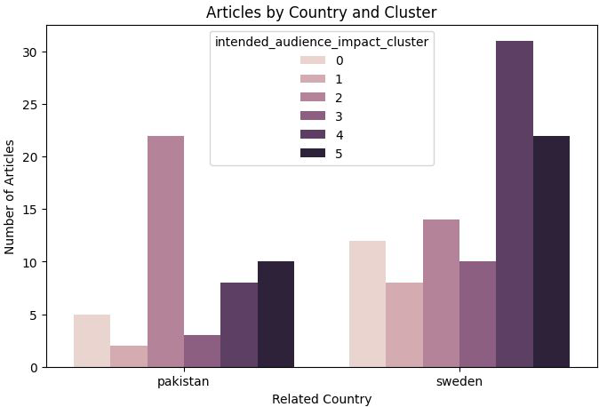
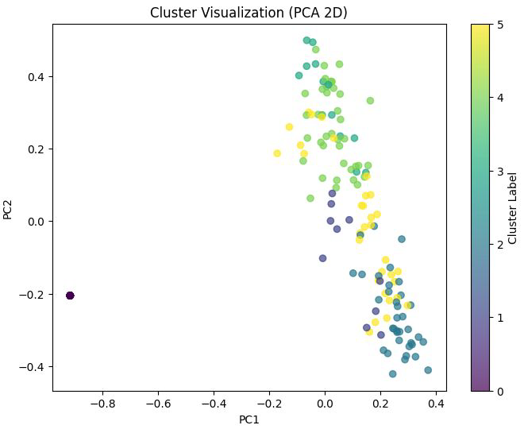

# Chinadaily: Sweden and Pakistan News Analysis

This README summarizes the analysis of news articles from Chinadaily concerning Sweden and Pakistan, as presented in the "Beyond the Headlines: Narrative & Sentiment exploration from News Reporting" project.

## 1. Introduction

This analysis aims to understand how Chinadaily, an English-language daily newspaper owned by the Publicity Department of the Chinese Communist Party, portrays Sweden and Pakistan. The project focuses on thematic structures, sentiment, and rhetorical patterns within the news articles. The motivation for comparing narratives about an ally country (Pakistan) and a perceived "enemy" or rival (Sweden) is to illuminate the mechanisms of state-sponsored media in shaping public opinion and international perceptions, revealing how such media constructs favorable views of an ally and critical views of a perceived adversary.

## 2. Datasets

The Chinadaily dataset includes:

* **179 articles** related to Sweden.

* **109 articles** related to Pakistan.

For each article, data such as page link, title, date posted, author, description, article body, news page, and matched keywords were collected.

**Related keywords used for data collection:**

* **Pakistan:** Pakistan, Pakistani, Gwadar, Karachi, Islamabad, Engro, Habib Bank, etc.

* **Sweden:** Uppsala, Sweden, Swedish, Stockholm, Scandinavia, Nordics, Nordic, etc.

## 3. Approaches & Results

The analysis employed two main approaches: Latent Dirichlet Allocation (LDA) for topic modeling and sentiment analysis.

### 3.1. Approach #1: Latent Dirichlet Allocation (LDA) on Article Text

This approach involved tokenizing article bodies, removing stopwords and country-specific words, and then performing LDA to identify key topics.

#### Chinadaily - Sweden (LDA Results - 5 Topics)

* **Topic 1:** china | chinese | world | development | global | economic | ai | new | eu | cooperation

* **Topic 2:** china | countries | people | xinjiang | international | chinese | world | government | rights | percent

* **Topic 3:** world | year | china | win | tour | final | season | time | record | second

* **Topic 4:** chinese | china | year | beijing | people | city | music | says | literature | old

* **Topic 5:** china | chinese | global | world | new | development | technology | research | international | market

#### Chinadaily - Pakistan (LDA Results - 7 Topics)

* **Topic 1:** china | countries | development | cooperation | global | international | world | bri | people | new

* **Topic 2:** china | xinjiang | people | government | chinese | rights | media | anti | called | report

* **Topic 3:** china | international | global | development | xi | world | chinese | eco | protection | environmental

* **Topic 4:** china | pakistan | chinese | world | year | sports | agricultural | life | team | city

* **Topic 5:** china | brics | space | satellite | trade | technology | innovation | international | beijing | high

* **Topic 6:** china | countries | world | economic | sanctions | united | percent | states | companies | chinese

* **Topic 7:** china | pakistan | cooperation | economic | development | sco | africa | global | projects | chinese

### 3.2. Approach #1.5: LDA on LLM Summaries

This refined approach used LLMs to generate more concise summaries of articles, aiming to better capture the essence and reduce redundancy before applying LDA.

#### Chinadaily - Sweden (LDA on LLM Summaries - 5 Topics)

* **Topic 1:** china | golf | tournament | open | volvo | chinese | swedish | players | women | us

* **Topic 2:** scientific | nobel | science | research | china | university | swedish | prize | laureates | international

* **Topic 3:** world | swedish | olympics | duplantis | tennis | cabin | pole | record | athletes | adidas

* **Topic 4:** china | chinese | global | development | economic | cooperation | technology | countries | international | swedish

* **Topic 5:** china | swedish | league | including | united | yes | country | region | eu | literature

#### Chinadaily - Pakistan (LDA on LLM Summaries - 7 Topics)

* **Topic 1:** pakistan | satellite | china | us | team | olympic | yes | men | space | games

* **Topic 2:** china | development | global | countries | initiative | cooperation | us | sustainable | bri | help

* **Topic 3:** pakistan | china | economic | cooperation | development | yes | regional | significant | bri | trade

* **Topic 4:** pakistan | china | author | cultural | yes | international | road | khan | university | research

* **Topic 5:** pakistan | cpec | terrorism | projects | security | concerns | corridor | attack | chinese | terrorism

* **Topic 6:** china | pakistan | global | international | cooperation | countries | development | south | role | building

* **Topic 7:** pakistan | china | chinese | cultural | exchange | international | culture | environmental | countries | cooperation

**Conclusion of Approach #1.5:** LDA on LLM summaries consistently outperformed LDA on raw article text in terms of clarity, coherence, and distinctiveness of topics, indicating that summarization helps distill key ideas.

### 3.3. Approach #2: Sentiment Analysis

Sentiment analysis was performed using the `Twitter-ro-BERTa-base` model to compare positive, neutral, and negative sentiment percentages.

#### Chinadaily - Sweden Sentiment Distribution (179 articles)

* **Positive:** 104 articles (~60.1%)

* **Neutral:** 55 articles (~31.8%)

* **Negative:** 14 articles (~8.1%)

#### Chinadaily - Pakistan Sentiment Distribution (109 articles)

* **Positive:** 55 articles (~53.4%)

* **Neutral:** 38 articles (~36.9%)

* **Negative:** 10 articles (~9.7%)

**Conclusion of Approach #2:** Chinadaily's coverage is more positive toward Sweden (~60.1%) than Pakistan (~53.4%), despite Pakistan being an ally. Neutral and negative sentiments are similar for both countries.

### 3.4. Approach #3: Rhetorical Analysis with LLMs

This approach utilized LLMs to generate in-depth rhetorical analyses, focusing on tone, implied motives, subtle implications, and intended audience impact. The LLM responses were then embedded and clustered to uncover patterns.

#### Chinadaily: Sweden and Pakistan - Intended Audience Impact Clusters

The clusters for intended audience impact showed varying distributions between Sweden and Pakistan, suggesting different rhetorical strategies employed by Chinadaily. Below is an illustrative example of the visualization and the corresponding cluster descriptions:

**Cluster Descriptions for Intended Audience Impact:**
* **Cluster 0:** ['china', 'global', 'author', 'chinese', 'readers', 'promoting', 'phrases', 'formal', 'positive', 'subtle']
* **Cluster 1:** ['china', 'energy', 'chinese', 'formal', 'readers', 'technology', 'vehicles', 'neutral', 'new', 'market']
* **Cluster 2:** ['china', 'economic', 'cooperation', 'development', 'pakistan', 'formal', 'phrases', 'author', 'positive', 'chinese']
* **Cluster 3:** ['china', 'phrases', 'golf', 'subtle', 'sports', 'formal', 'chinese', 'world', 'used', 'neutral']
* **Cluster 4:** ['formal', 'readers', 'subtle', 'loaded', 'emotional', 'phrases', 'terms', 'suggests', 'author', 'used']
* **Cluster 5:** ['china', 'chinese', 'formal', 'subtle', 'scientific', 'sense', 'cultural', 'neutral', 'phrases', 'readers']

Notably, **Cluster 2**, which is characterized by terms like ['china', 'economic', 'cooperation', 'development', 'pakistan', 'formal', 'phrases', 'author', 'positive', 'chinese'], is significantly more prevalent in articles related to Pakistan than to Sweden. This suggests that Chinadaily's coverage of Pakistan more frequently emphasizes themes of economic cooperation and development, aligning with the positive portrayal of an allied nation.

#### Chinadaily: Sweden and Pakistan - Implied Motives Clusters

The implied motives varied, often highlighting China's role in global development, economic cooperation, or cultural exchange. For Pakistan, topics like CPEC (China-Pakistan Economic Corridor) and security were prominent.

#### Chinadaily: Sweden and Pakistan - Subtle Implications Clusters

Subtle implications often involved the use of formal language, positive phrasing, and an emphasis on cooperation and development.

#### Chinadaily: Sweden and Pakistan - Stylistic Features Clusters

Stylistic features included formal tone, positive language, and the use of phrases that convey a sense of cooperation and shared goals.

## 4. Conclusion

This analysis of Chinadaily's portrayal of ally Pakistan and rival Sweden reveals distinct editorial strategies. Thematically, articles on **Pakistan heavily emphasized economic cooperation and development**, particularly the Belt and Road Initiative. In contrast, **Sweden's coverage focused more on global issues, science, and sports.**

While sentiment analysis showed a slightly more positive tone for Sweden, this should be considered within the context of official news. Crucially, rhetorical analysis highlighted a **prevalent emphasis on 'economic cooperation' and 'development' in Pakistan's narrative**, reinforcing its allied status. However, Pakistan's coverage also touched upon more complex topics like 'terrorism', indicating a nuanced, though generally positive, portrayal that differs significantly from Sweden's. Chinadaily thus tailors its narratives to reflect geopolitical relationships and strategic communication goals.

## 5. Limitations

The project identified several limitations:
* **Keyword Choice:** General keywords can lead to oversampling or trigger articles not directly about the subject.
* **LLM Text Generation:**
    * Model prompts are crucial and require extensive experimentation.
    * Responses don't always follow specified structures, making parsing difficult.
    * LLMs tend to be agreeable, potentially generating uniform results even if implications aren't present.
    * LLMs often use similar expressions, reducing the efficiency of TF-IDF and making embedding spaces compact.
